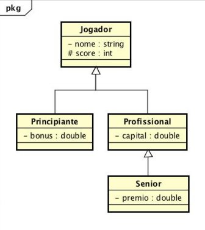

## Considere	a	hierarquia	de	classes	representado	no	diagrama	acima.	Os	atributos são	anotados	com	um	símbolo	" - "	para	indicar	visibilidade	private e	com	um símbolo	"#"	para	indicar	visibilidade	protected.	Implemente	as	classes	com	os atributos	indicados	no	diagrama acima e	com	métodos	da	seguinte	forma:
1. Classe	Jogador
    * Método	construtor
    * void	imprimir(	) :	imprime todos	os	atributos	do	objeto
2. Classe	Principiante
    * Método	construtor
    * void	imprimir(	) :	imprime	todos	os	atributos	do	objeto
    * void	ganhar(int	p) :
        + adiciona	p	ao	score;	
        + adiciona	10%	de	p	ao	bonus.
    * void	perder(int	p) :
        + subtrai	p	do	score
        + desconta	10%	de	p	do	bonus.
3. Classe	Profissional
    * Método	construtor
    * void	imprimir(	) :	imprime	todos	os	atributos	do	objeto
    * void	ganhar(int	p ) :
        + adiciona	p	ao	score;
        + aumenta	o	capital	de	p	*	4
    * void	perder(int	p) :
        + subtrai	p	do	score
        + diminui	o	capital	de	p	*	4
4. Classe	Senior
    * Método	construtor
    * void	imprimir(	) :	imprime	todos	os	atributos	do	objeto
    * void	ganhar(int	p ) :	
        + chama	o	método	ganhar	da	superclasse
        + dobra	o	valor	do	prêmio
    * void	perder(int	p ) :	
        + chama	o	método	perder	da	superclasse
        + reduz	o	valor	do	prêmio	à	metade

### Deve	ser	implementada	uma	classe	adicional	denominada	**Teste** contendo	o	método	_main_ que	deverá	criar	um	objeto	de	cada	tipo	de	jogador	(Princiante, Profissional	e	Senior)	e	chamar	todos	os	métodos	disponíveis	para	esses	objetos.
