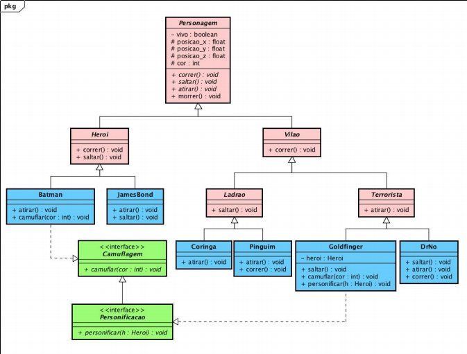

# Implemente	as classes	e	interfaces	representadas no	diagrama	acima,	de	acordo	com	a	seguinte	definição	de	atributos	e	métodos.
1.	**Atributos**
* boolean	vivo:	indica	se	um	personagem	está vivo	(true)	ou	morto	(false)
* float	posicao_x	:	posição	de	um	personagem	no	eixo-x	do	espaço
* float	posicao_y:	posição	de	um	personagem	no	eixo-y	do	espaço
* float	posicao_z:	posição	de	um	personagem	no	eixo-z	do	espaço
* int	cor: código da	cor	de	um personagem
* Heroi	heroi:	referência	para	a	instância	de	Heroi	personificada	pelo	objeto	da	classe	Goldfinger
2.	**Métodos**
* correr(float	x,	float	y):	atualiza os atributos	posicao_x	e	posicao_y e imprime	a	mensagem "C	correndo",	onde C é	o	nome	da	classe	que	implementa	o	método.	Por	exemplo "Heroi correndo ..."
* saltar(float	z):	atualiza	o	atributo posicao_z e imprime	a	mensagem "C saltando", onde	C é	o	nome	da	classe	que	implementa o método. Por exemplo, "Goldfinger saltando ..."
* atirar():	imprime	a	mensagem	"C atirando	...",	onde	C é	o	nome	da	classe que	implementa	o	método.	Por	exemplo,	"Batman atirando...
* morrer():	atualiza	o	atributo	vivo	para	false e	imprime	a	mensagem "Morto".
* camuflar(int	cor):	atualiza	a	cor	do	personagem	e imprime	a	mensagem	
"C	camuflando",		onde	C é	o	nome	da	classe	que	implementa	o	método.	
Por	exemplo,	"Batman camuflando ..."
* personificar(Heroi	h):	atualiza	a	referência	heroi	da	classe	Goldfinger	e	
imprime	a	mensagem	"Personificando"

### Deve	ser	implementada uma	classe	Teste	contendo	o	método	main,	o	qual	deverá criar	um	objeto	de	cada	classe	concreta	do	diagrama	e	chamar	cada	um	dos	seus métodos	ao	menos	uma	vez.