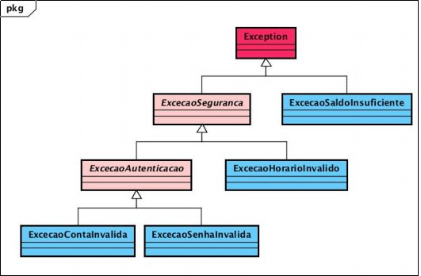
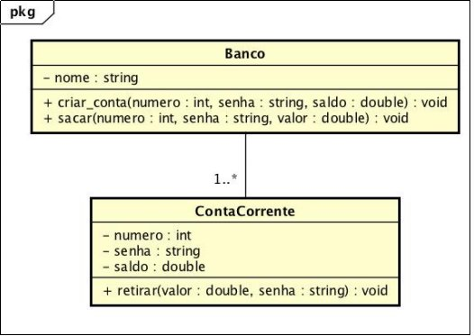

# Implemente	as	classes	representadas	nos	diagramas abaixo conforme	as	definições	a	seguir.

1. O	método	**retirar** da	*classe* **ContaCorrente**	pode	lançar os seguintes	tipos de	exceção:
    * **ExcecaoSenhaInvalida**
    * **ExcecaoSaldoInsuficiente**
2. O	método	**sacar**	da	*classe* **Banco**	pode	lançar os	seguintes	tipos	de	
exceção:
    * **ExcecaoContaInvalida**:	lançada	quando	é	fornecido	um	número	de	
    conta	inexistente.
    * **ExcecaoSenhaInvalida**:	lançada	quando	a	senha	fornecida	é
    diferente	da	senha	cadastrada	para	a	conta	corrente.
    * **ExcecaoHorarioInvalido**:	lançada	quando	o	horário	de	tentativa	de	
    saque	ocorre	antes	das	8h	ou	depois	das	22h.
    * **ExcecaoSaldoInsuficiente**:	lançada	quando	não	há saldo	suficiente	
    para	realizar	o	saque	solicitado.
3. O	método	**main**	de	uma	*classe	Teste*	deve	criar	um	objeto	da	*classe* **Banco**	
e,	em	seguida,	deve	chamar	métodos	da	seguinte	forma:
    * Chamar	5	vezes	o	método	**criar_conta** (com	isso,	são	criadas	5
    instâncias	de	ContaCorrente)
    * Chamar	10	vezes	o	método **sacar**.	Devem	ser	usados	valores	para	
    os parâmetros tal	que	ocorra,	ao menos	uma	vez,	uma	exceção de	
    cada	tipo.
